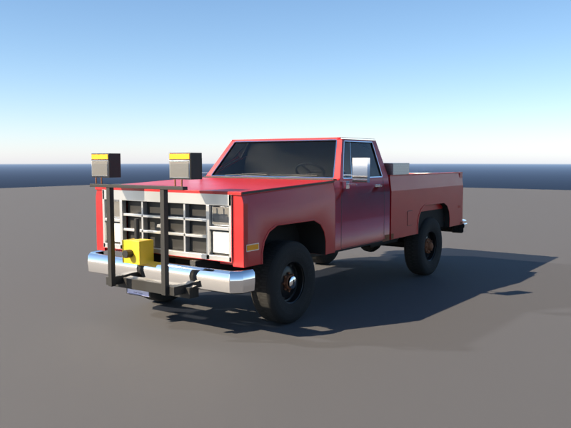
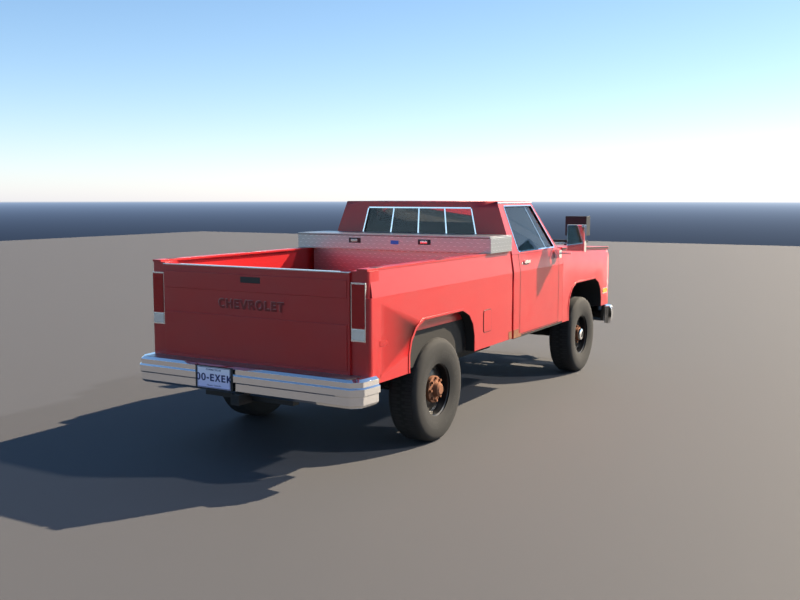
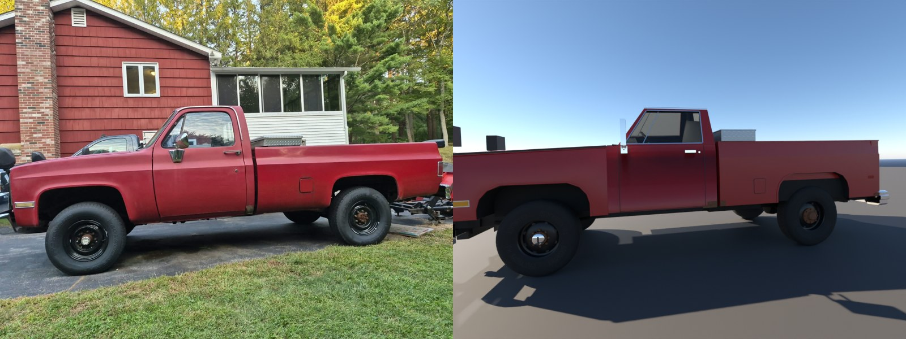
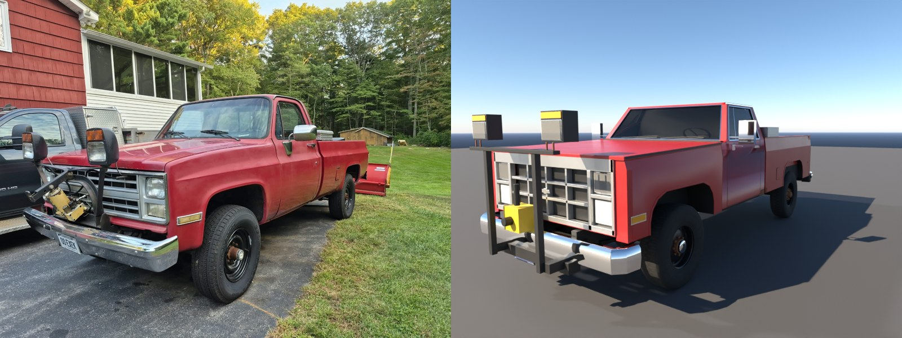
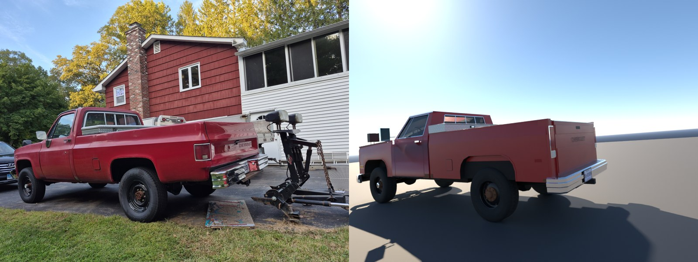

# Bob's Truck for BeamNG.drive

A drivable BeamNG.drive mod of Bob's **1985 Chevrolet K20**: square body, regular cab, long bed, 4x4. The mesh and physics were built from the photos in `reference/`.




### Model vs. photos

Each photo's camera was solved from the wheel positions (`tools/camfit.py`), and the model is rendered from that exact spot in Blender:





## Install

1. Download `dist/bobs_truck.zip`.
2. Put the zip **as-is** (don't unzip it) in your BeamNG mods folder:
   - Windows: `Documents\BeamNG.drive\mods\` (newer versions: `%LOCALAPPDATA%\BeamNG.drive\<version>\mods\`)
3. Start the game and open the vehicle selector. Look for **Chevrolet → K20 (Bob's Truck)**.

## What's in it

| | |
|---|---|
| Body | '85-'86 square body regular cab long bed: shoulder crease line, arch lips, rounded bed corners, argent egg-crate grille with bowtie, rectangular sealed-beam headlights, stamped CHEVROLET tailgate, 4-pane sliding rear window, chrome mirrors, dual fuel doors, stake pockets, and the rust spots at the cab and bed corners |
| Wheels | Black 8-lug steelies, chrome-dial locking hubs up front, rusty full-floating hubs in the rear, ~32" Yokohama Geolandar H/T tires with sidewall lettering |
| Bumpers | Chrome front bumper; chrome rear step bumper with a diamond-plate top, receiver hitch and the CT "Classic Vehicle" plate |
| Drivetrain | 350 V8 (~165 hp / 275 lb-ft), TH400 3-speed automatic, 4x4 (locked transfer case), 4.10 gears |
| Suspension | Solid axles front and rear, steered front axle with king pins and a tie rod |
| Parts (swap in the Parts menu) | UWS diamond-plate crossover toolbox, Western Unimount plow frame with plow lights, red Western 7.5' straight blade |

Configurations:
- **Bob's Truck (Plow Frame)**: as it sits in the driveway (default)
- **Bob's Truck (Plowing)**: blade on
- **Bob's Truck (Summer)**: no plow frame, no toolbox

Paint is set up as instance paint. The default is the faded cardinal red, and you can repaint it in-game.

## Status / known limitations

This is a **v1 built without access to the game**. The mesh, textures and physics are all generated from code in this container, and everything below has been checked here:

- every node, beam, group, mesh, material and texture reference is consistent (`tools/validate.py`)
- an offline mass-spring simulation of the jbeam (`tools/simcheck.py`) shows it settles stably at the modelled ride height, the suspension sags realistically under the plow, and steering input turns both front wheels the right way (~30-33° lock)

It has **not been test-driven in BeamNG yet**. The likeliest things to need tweaking after a first drive:
- tire stiffness/grip values (`TIRE` in `tools/build_jbeam.py`)
- the engine sound sample name (`soundConfig.sampleName`)
- if the truck drives backwards in D, flip the `wheelDir` values in `pressureWheels`

Not done yet: working headlights/taillights (light glow + spotlights), a steering wheel that turns, opening doors/tailgate, a hydraulic plow lift, detailed crash deformation (the body shells are coarse node cages).

## More photos that would help

Interior (dash, seat, door panels), the engine bay, the grille/front straight on, and the underside (axles, exhaust, tanks).

## Rebuilding

```
pip install numpy pillow scipy bpy
./build.sh
```

Pipeline:
1. `tools/build_truck.py`: procedural geometry (panels, crease lines, lamps, wheels…), textures and BeamNG materials
2. `tools/build_jbeam.py`: physics, configs, info files
3. `tools/blender_build.py`: runs Blender headless (`bpy`). It welds the meshes, bevels every hard edge, smooths normals, exports the final `bobs_truck.dae` and `preview/bobs_truck.glb`, and renders the vehicle-selector thumbnails. Run it without `--no-render` to get the Cycles comparison renders in `preview/`.
4. `tools/validate.py` and `tools/simcheck.py`: consistency checks and an offline physics sanity simulation
5. Everything is zipped into `dist/bobs_truck.zip`.

`tools/camfit.py` re-solves the photo cameras and writes `preview/overlay_*.jpg`. Drop new photos in `reference/` and add a few wheel-point correspondences to use them.

`preview/bobs_truck.glb` is the finished model as glTF, and opens in any 3D viewer (Windows 3D Viewer, Blender, gltf-viewer.donmccurdy.com).

Coordinates: +X = left, +Y = rearward, +Z = up, metres; front axle at y=0, rear axle at y=3.34 (131.5" wheelbase).
